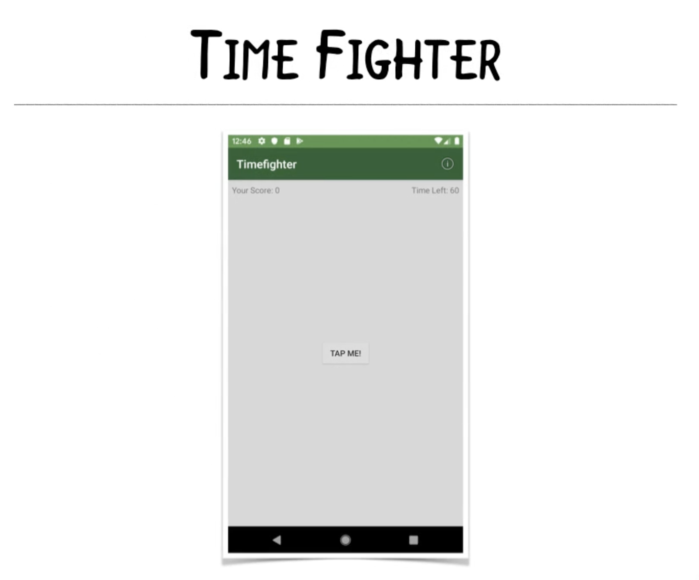

# 1 - Intruduction

`Hey everyone, it's Roel here, and this is the Your First Kotlin Android App course. If you are interested in Android development using Kotlin, this is the place to start. In this course, you will learn how to create an Android app from the ground up, even if you have no prior programming experience at all.`

## Course Overview

* **Install Android Studio**
* **Create a fun game**
* **Learn Kotlin basics**
* **Debugging techniques**
* **packaging and publishing your app**

`We will go over what you need to do to set up a working Android development environment. We will then go through creating a brand new project and learn about Android development by creating our own fun game using Kotlin. We will also go over a few debugging techniques. And finally, we'll finish off with learning what it takes to package your app to publish on the Google Play store.`

### SECTION OVERVIEW

* **Android Studio**
* **Creating a new project**
* **Virtual device**
* **Physical device**
* **Create a to-do list**

`This first section will focus on getting your development environment set up, so you can start learning by doing. We will go over installing and setting up Android Studio,  starting a new project, running it, and finally, creating a programming task list or to-do list. Now, when learning anything new, it helps to have some sort of goal in mind to keep us focused.`

`This is Time Fighter. It's a frenzied game testing your accuracy, dexterity, and mental acuity as you race against time. To start the game, you tap the single button on the center of the screen. You then have 60 seconds to tap the same button as many times as you can. Each tap of the button increases your score by one. When the timer runs out, the app will notify you of your score, and reset the game to be played again.`  

`Don't be fooled by the simple gameplay. There is a lot going on behind the scenes that will teach you a lot of the fundamentals for building an app. There is a lot to do here. To keep us focused, we'll create a programming to-do list. A to-do list is important, as it will keep track of everything we need to do to complete the game.`

`So let's get started.`

