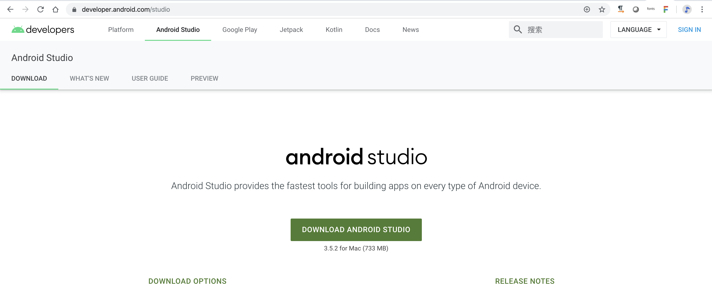
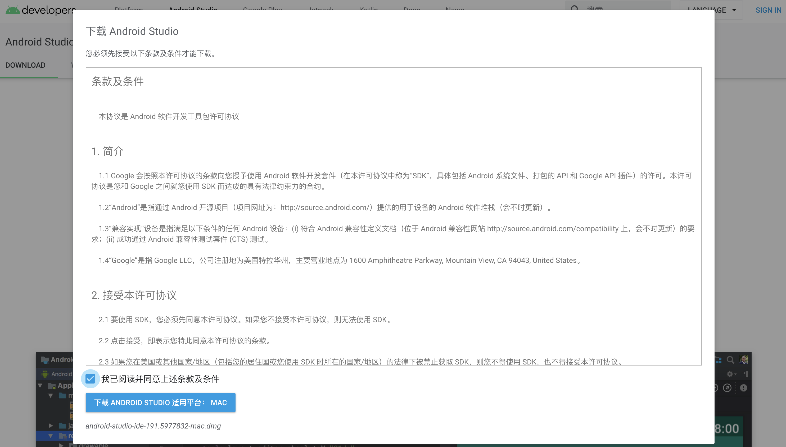

# 2 - Download Android Studio

When programming, it is common to have some sort of application where you can write code and save it to a file. This is sometimes known as a text editor. Once we have our code written the next step is  to take that code and transform it into something that a computer understands and can run. This is known as compiling.

To make things easier,  some programming languages have specialized applications called an IDE or Integrated Development Environments. Basically an IDE is a supercharged text editor that integrates specialized programming functions like compiling into a single application. 

These IDEs make it easier to write code and compile it with the click of a button. This brings us to the IDE we will be using throughout this course called Android Studio. Android Studio is an IDE specifically designed for building Android apps. Our first task will be downloading and installing Android Studio.

Open your web browser of choice and navigate to [developer.android.com/studio](https://developer.android.com/studio). 

The link can also be found in the author notes below. Once the page loads, click on the Download Android Studio button.

You'll need to read and agree to the terms and conditions before downloading.

Once the install file has been downloaded you can begin to install Android Studio. At this point, the install process will be different depending on what system you are on. Here, I am using Mac OS. 

When the install process is complete, you should be able to start the Android Studio application. Next you'll be asked to download and install an SDK. Just leave everything on the defaults to install the default SDK. When the install is complete, click Finish. That does it for setting up Android Studio.  If you are wondering what an SDK is, we'll cover this in the next video when we setup your very first Android project.

