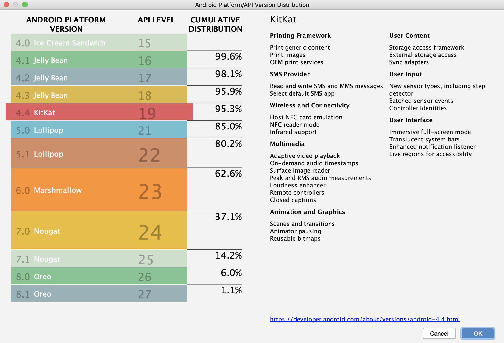

# 3 - First Project

Now that you have Android Studio up and running it's time to get started with your first project. 

Before we do that, let's go over something we installed in the previous video, which is the SDK. An SDK, or Software Development Kit, is a prebuilt library of tools that help you build your application.  Think of it as code that other people have written so that you don't have to.

In the world of Android, there are different versions of the Android SDK. They are usually tied together with the different versions of Android. 

This course is designed to work with Android version 4.4. Since this isn't the same version as the default one we installed previously, we'll see how we set it up as we create our new Android Project. 

Let's get to it.

With Android Studio running, click on the Start a New Android Studio Project option which will bring up a New Android Studio Project option which will bring up a handy wizard to setup your project.

The first thing we need to decide on is the kind of application we want to build. Feel free to explore the different options available to you here.  For this course, we are going to build a Phone application, then choose Empty Activity, then click Next.

Set the name of the application to Time Fighter, and the package name to com.dev.timefighter. If you plan on submitting your app to the Play store, add another dot and then your full name, to make sure your package name is unique, otherwise you may get an error later on.  Change the Save location if you wish,  I'm going to leave mine as the default.  Since this course is designed for Kotlin,  ensure the language selected is Kotlin. Now we are at the part where we chose the API version,  which is essentially the version of the SDK we want to use.  This is important as it determines how widely available  our app can be for the general public. Select API 19.  Notice that there is a help note below showing you the estimated percentage of how many devices the application can be run on.

If you click on the Help me choose link, this will bring up a handy diagram to evaluate your decision.

For future projects you'll want to carefully consider what API to use. Knowing how to balance features availability should be something you can decide on. Click OK to close the window.

Click Finish to create the project.

This will download and install the selected SDK if necessary, and then create an new empty project based off of the Empty Activity template we selected earlier.

When everything is complete, you'll come to the project screen like this.

And thanks to Android Studio being an IDE, the app will compile automatically for you and show green checkmarks indicating that everything is good to go.

