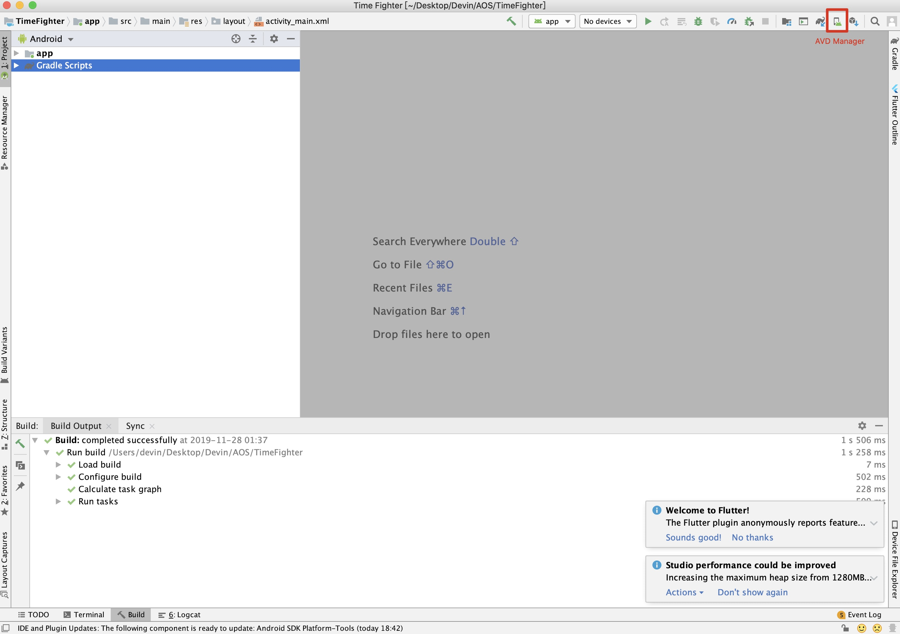
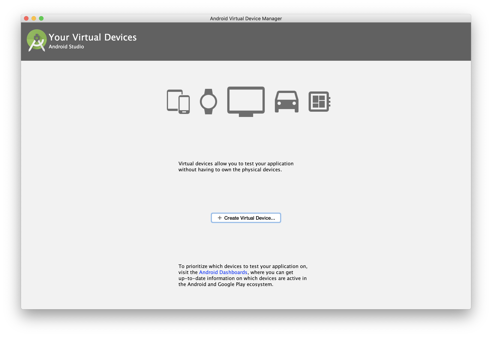
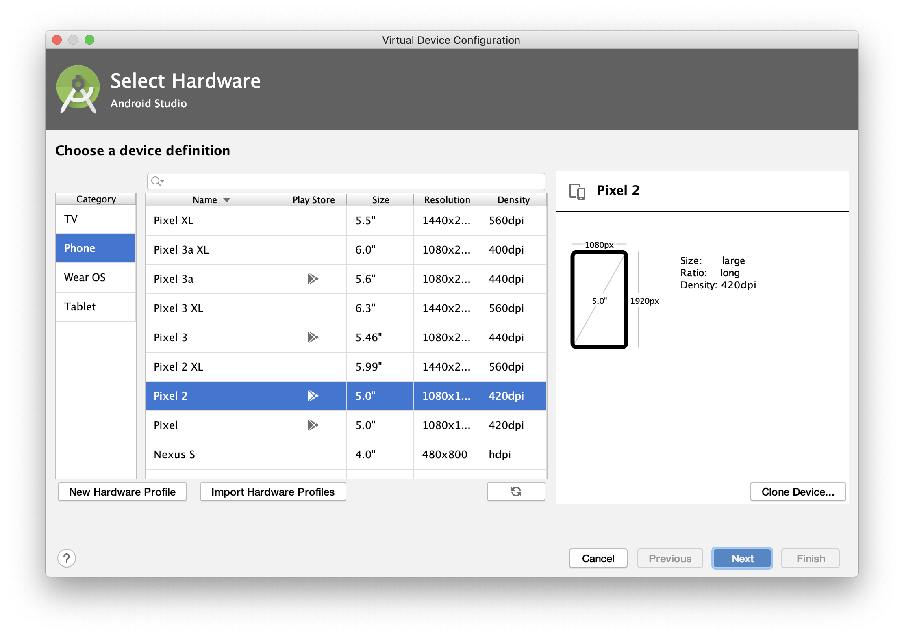
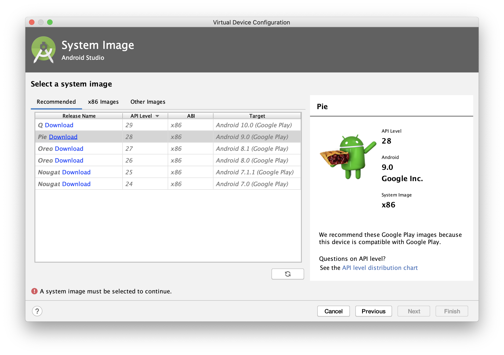
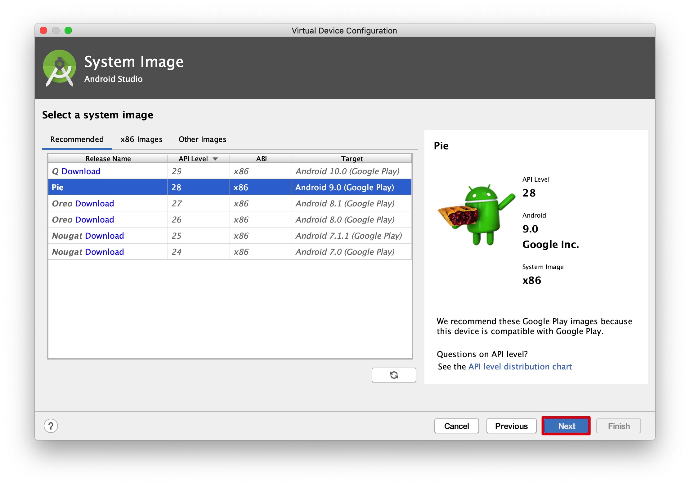
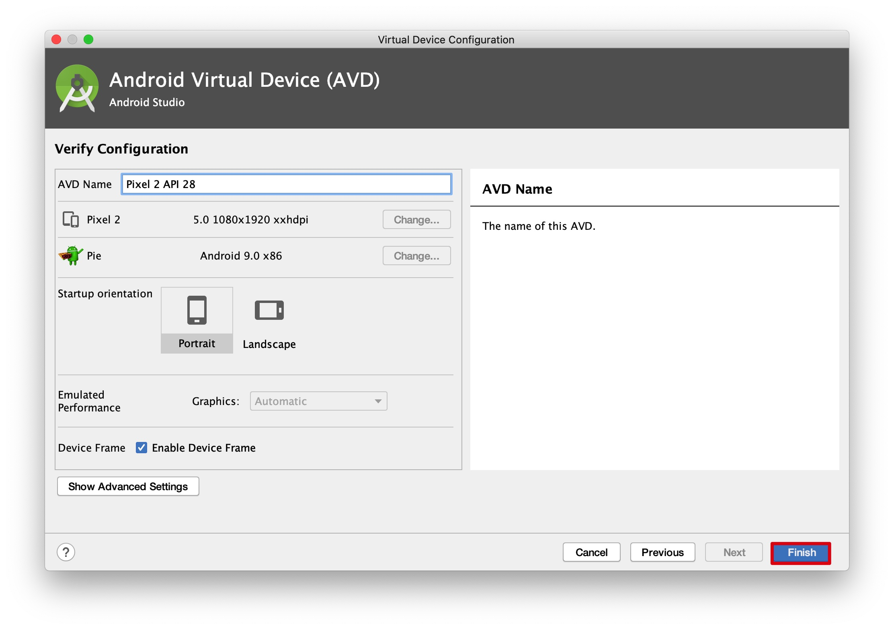
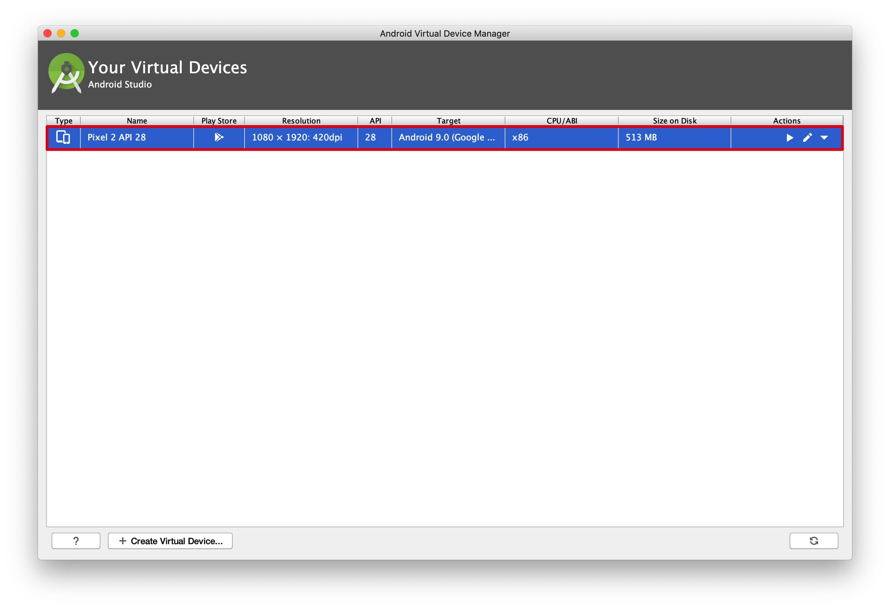
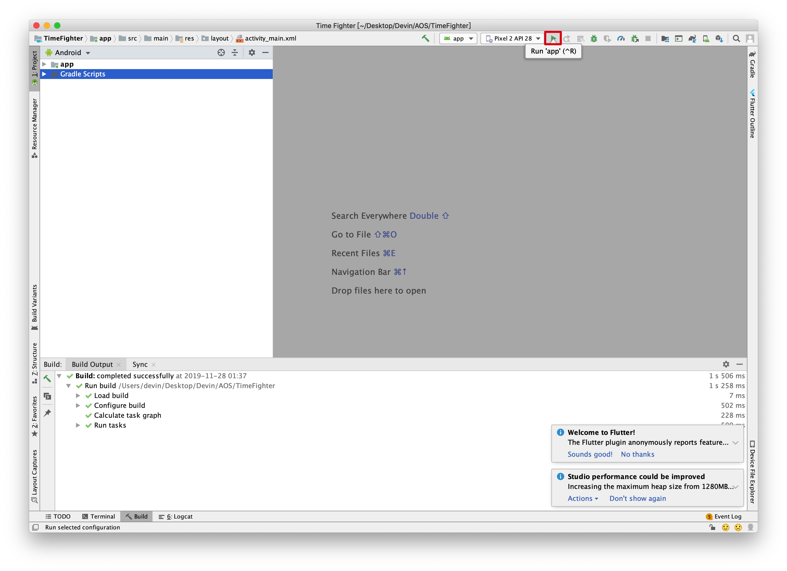
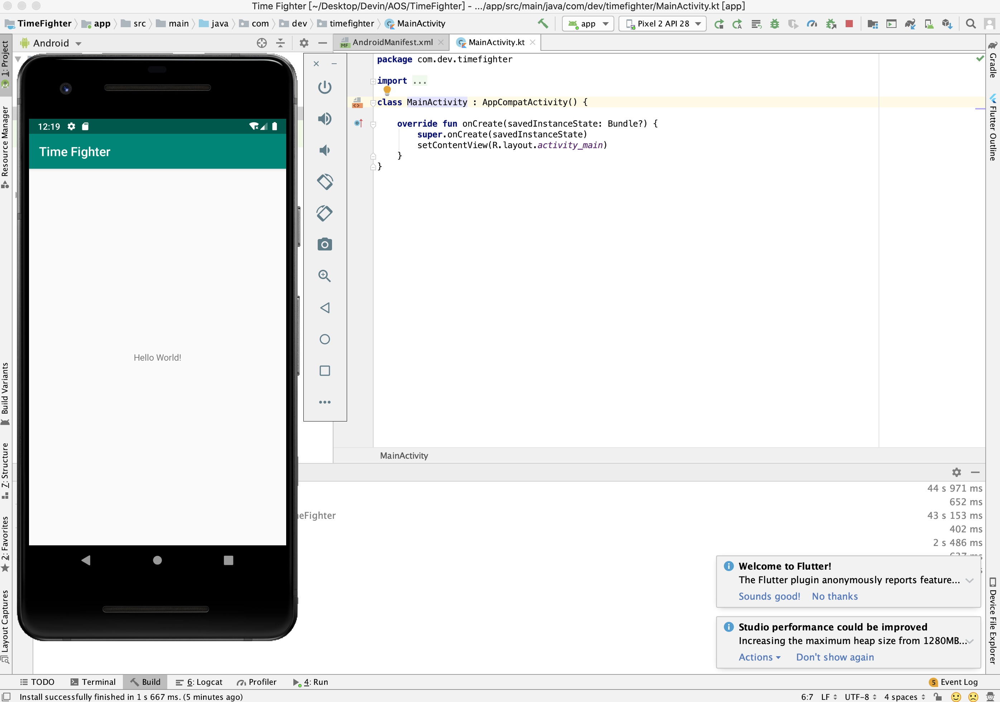

# 4 - Build Your Project

We now have our brand new project in Android Studio, but before we get coding there are a few things we need to take care of first.

First, we'll make sure that the empty project we have works. This requires us to build and run it. Building is part of the development process usually handled by an IDE. In our case Android Studio handles building our project which means compiling the code and packaging any assets like images, videos, or artwork into something that can run on an Android device.  

When developing applications on our computer, we have the advantage of running the applications on a virtual device. This makes testing our application easier and quicker. A virtual device is a program that runs on our computer.  It can mimic a real device, which is good enough when developing.  We need to set up a virtual device before we can use it, so let's do that now.

Open up the Time Fighter project if it is not yet open. The interface of Android Studio may seem overwhelming at first, but you'll become more familiar with it as we progress through the course.

First I'd like to turn your attention to the top right row of icons. Hover over the one that looks like a device with the Android in front. It should show as AVD Manager.

Click this button to open the Android Virtual Device Manager.

Click on Create Virtual Device. This will bring up a list of the many devices you can simulate. Feel free to explore the different options here. 

For our application, we will be testing on a Pixel 2. Select it and click next. Next we need to decide which version of Android we want to run on the virtual device.

Choose any one of the recommended images. Select the Download link to download the image first. 

Click Next to continue.

Leave the device configurations to their default settings

and click Finish.

Close this window.

Now let's build and run. In the top right row of icons again, look for the green arrow button.

Click on it. Select the virtual device we created earlier and click OK. After a few moments you should see a device show up on your screen with the empty project running.

