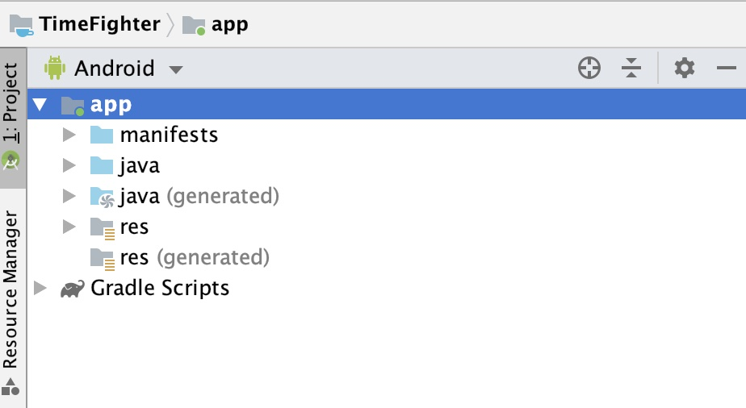
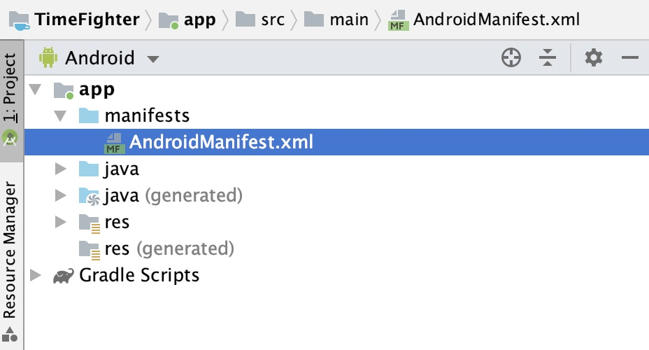
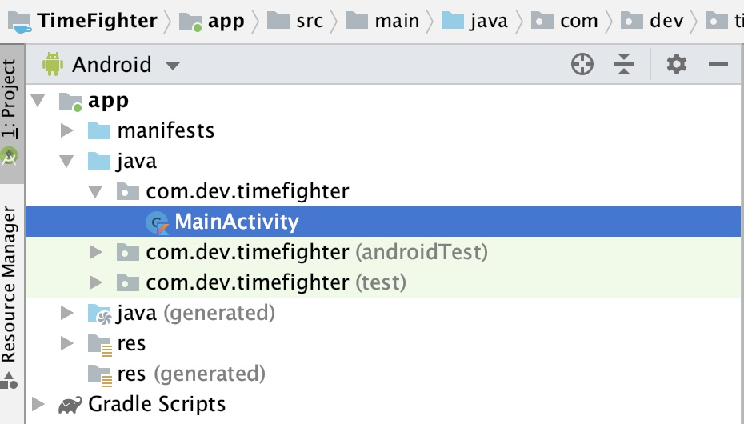
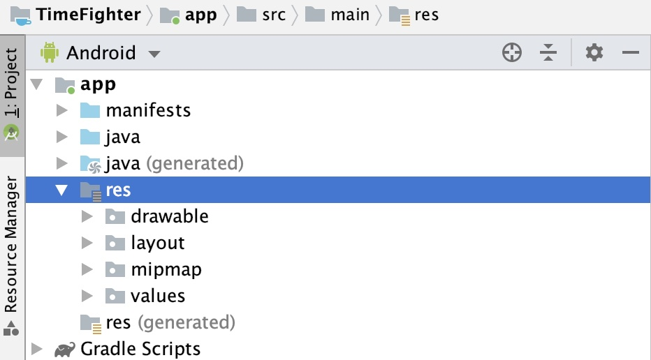
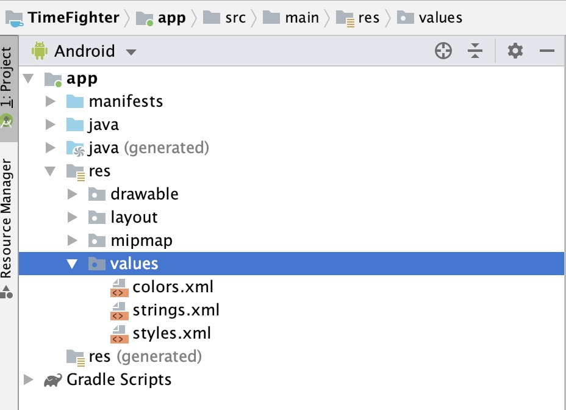

# 6 - Project Contents

So we have a brand new empty Android project. Before we get into coding, let's take some time to get familiar with the contents of our project.

Even though this is a new project, you may have noticed that Android project is already made up of different files and folders. These files all have specific purposes for building your application and could be used for things like displaying graphics, playing sounds, or constructing layouts.

You can view all of these files in the app section in Android Studio.

Let's go through a few of these.

The AndroidManifest.xml file provides important information required to configure and run your app.

The Java directory contains all the source that you will be writing for your app.

Note, even though that the directory is called Java, we are still writing all the code in Kotlin.

The res directory is your resource directory for images, layouts, styles, and colors.

Each type of resource has its own subdirectory. 

* Anim is for animations. 
* Drawable is for images.
* Layout is for user interface elements.
* Menu is for menu interfaces and buttons. 
* Mipmap holds your launch images for your splash screens.

And finally, values is where you define resources for colors in colors.xml, strings in string.xml, and styles in styles.xml.

That probably sounds like a lot. There is no need to memorize everything here. This course will guide you when we need to modify any of these files.

