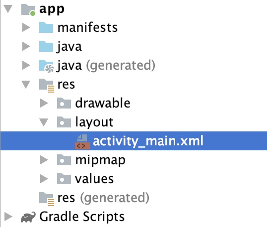
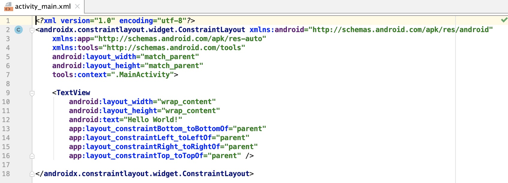
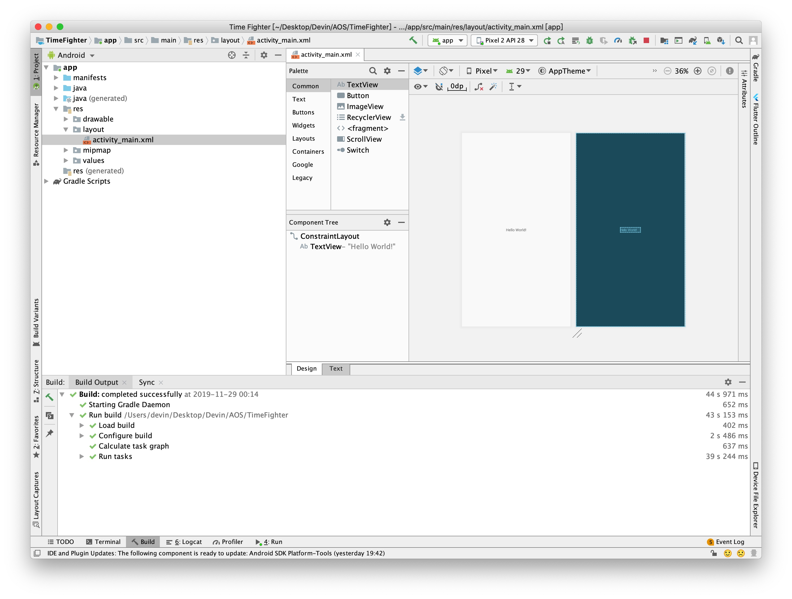
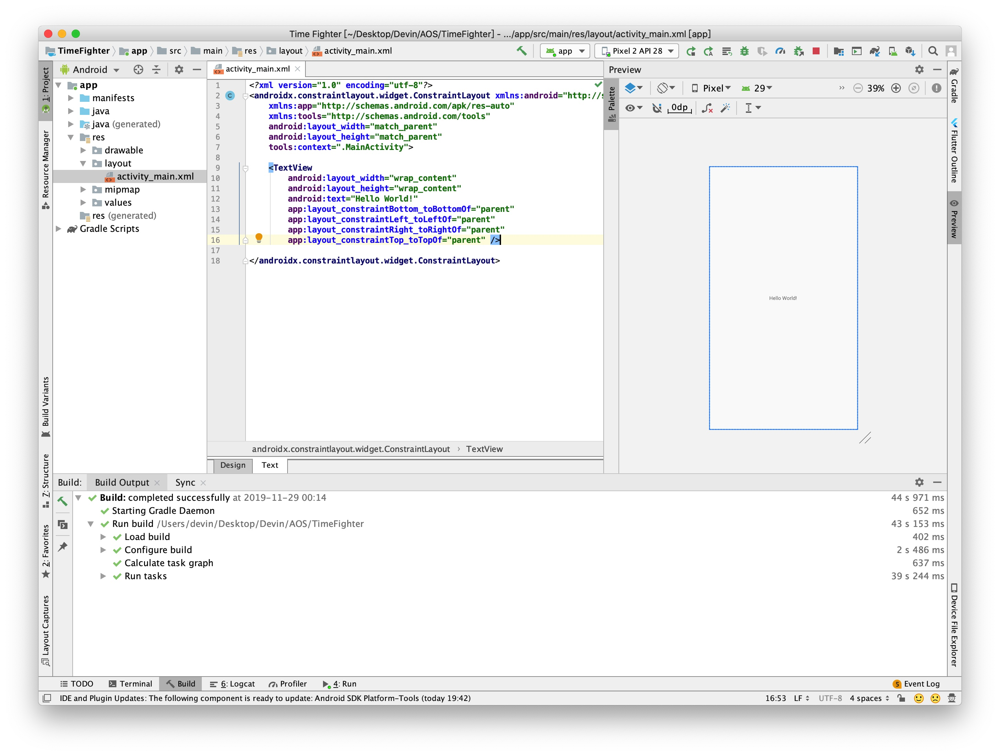
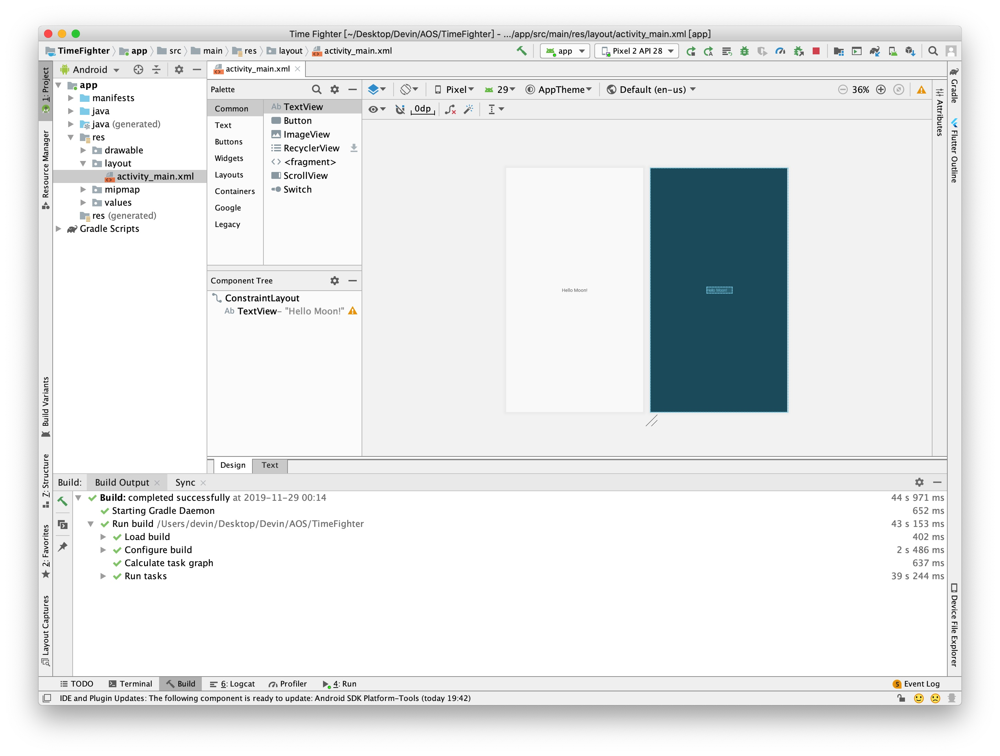
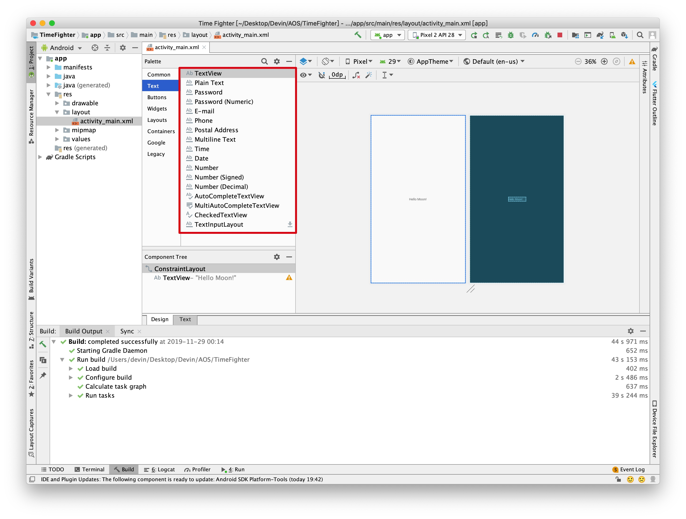

# 10 - Modifying the UI

We created the empty start project in part one of this course along with a to-do list of tasks needed to complete our game, Time Fighter.

 Let's start crossing off some of those items in our list. Taking a look at our list,

* **Add a "Tap ME" button**
* **Add text for the game score**
* **Add text for the time left**
* ...

add a Tap Me button,  add text for the game score,  add text for the time left. 

These three items are to add UI elements to Time Fighter, and that is always a good place to start.  Being able to see what you are building lets you get the ball rolling when you're developing an app. It's the first thing your user will see and interact with. The game logic and what happens when users interact with your UI are all behind the scenes in what are called activities. We'll get to activities in part three of this course.

A well thought-out and intuitive UI goes a long way towards making a successful app. If the user does not understand how your app works, or if it is not clear what a specific button or control does, your users might not like using it. So, getting the UI right is essential. Thankfully, Android Studio gives you the necessary tools to build a good UI. The layout file `activity_main.xml` contains the definitions of your UI for your main activity.

Everything that you saw when you ran the Time Fighter app earlier is in this layout.

Incidentally, layout is the technical term for these files containing an Android app layout, and the file extension XML indicates that this is an XML, or eXtended Markup Language file.

If you're not familiar with XML, that's fine. It's just a markup format similar to HTML, which is what is used to create web pages.  Since XML is simply a text file,  you can edit these layouts with a text editor. Fortunately, Android Studio also has a visual editor to manage your layouts.

Let's take a look.

With your project open, drill down to app, res, layout, and then double-click activity\_main.xml. Here you can see our current layout.

To see the raw XML, tap the Text tab on the bottom left of the visual editor to be taken to the text editor.

The XML contains a TextView,  which is a control for displaying the text. There's an attribute called text which says Hello World. Change it to read Hello Moon, and switch back to the design.

You'll see that the text is updated for you.  We'll be using the visual editor to build our layouts. It's easier to create a UI visually most of the time than to do the same thing via code.

Okay, let's get to work building our layout.  Although our to-do list says to add a button first, we'll start with a label since it's simpler. In Android terminology,  a label is called a TextView, since it displays text. You already have one TextView on the layout as you've noticed,  the one that says Hello Moon. Let's add another one so that you can see how it's done.

We add controls by way of the Palette.  It contains all the controls available to the user to place on a layout. The category list on the left organizes our controls. For example, selecting the Text category, lists all the text controls.

Beneath the palette is the component tree. The component tree is a tree representation of the controls on the layout. The component tree is an easy way  to select a particular control on the layout when you have lots of controls in play. Often times, you'll want to look for a specific control and thankfully, the search feature can help. In the search feature, type image and you'll see the image controls available to you. For now, we want to add a label  so select the Text category in the Palette, and then select TextView from the controls list. Drag the TextView on to the top left corner of the layout and then release. The alignment controls appear as you drag the TextView close to the top left edge as you can, following the layout guides. You'll notice that the text view appears in the component tree. If we select the Text tab, you can see new XML was added to reflect our new control. Switch back to the Design tab and run your app.

Now we are up and running with not just one, but two text views.

